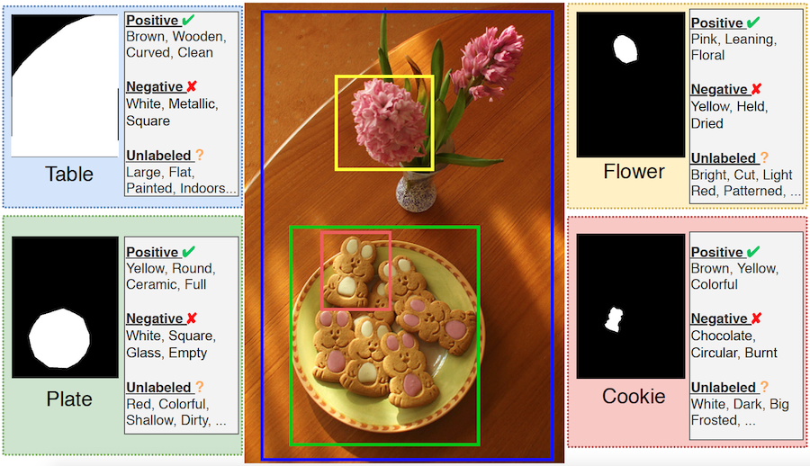

# Visual Attributes in the Wild (VAW) and Large Scale Attributes (LSA) Dataset

This repository provides data for the VAW dataset as described in the <a href="https://cvpr2021.thecvf.com/" target="_blank">CVPR 2021</a> Paper:
### [Learning to Predict Visual Attributes in the Wild](https://openaccess.thecvf.com/content/CVPR2021/html/Pham_Learning_To_Predict_Visual_Attributes_in_the_Wild_CVPR_2021_paper.html)
and the LSA dataset described in our <a href="https://eccv2022.ecva.net/" target="_blank">ECCV 2022</a> Paper:
### [Improving Closed and Open-Vocabulary Attribute Prediction using Transformers](https://vkhoi.github.io/TAP/)
[Khoi Pham](https://vkhoi.github.io/),
[Kushal Kafle](https://kushalkafle.com), 
[Zhihong Ding](https://research.adobe.com/person/zhihong-ding/),
[Zhe Lin](https://research.adobe.com/person/zhe-lin/),
[Quan Tran](https://research.adobe.com/person/quan-hung-tran/),
[Scott Cohen](https://research.adobe.com/person/scott-cohen/),
[Abhinav Shrivastava](http://www.cs.umd.edu/~abhinav/)
 


- [Part I: VAW DATASET](#the-vaw-dataset)
  * [Dataset Setup](#dataset-setup)
    + [Annotation Format](#annotation-format)
  * [Download Images](#download-images)
  * [Explore Data and View Live Demo](#explore-data-and-view-live-demo)
  * [VAW Dataset Statistics and Evaluation](#vaw-dataset-statistics-and-evaluation)
    + [VAW Basic Stats](#vaw-basic-stats)
    + [Evaluation](#evaluation)
- [PART II: LSA DATASET](#the-lsa-dataset)
  * [Introduction](#introduction)
  * [Download and Setup LSA Annotations](#download-and-setup-lsa-annotations)
    + [Annotation Format](#annotation-format-1)
    + [Download Images](#download-images-1)
- [Citation](#citation)
  * [Disclaimer and Contact](#disclaimer-and-contact)


# The VAW Dataset

## Dataset Setup

Our VAW dataset is partly based on the annotations in the 
[GQA](https://cs.stanford.edu/people/dorarad/gqa/about.html) and 
the [VG-PhraseCut](https://github.com/ChenyunWu/PhraseCutDataset) datasets. Therefore, the images in the VAW dataset come from the [Visual Genome](https://visualgenome.org/) dataset which is also the source of the images in the GQA and the VG-Phrasecut datasets. This section outlines the annotation format and basic statistics of our dataset.

### Annotation Format

The annotations are found in ``data/train_part1.json``, ``data/train_part2.json`` , `data/val.json` and `data/test.json` for train (split into two parts to circumvent github file-size limit), validation and test splits in the VAW dataset respectively.
The files consist of the following fields:

```
image_id: int (Image ids correspond to respective Visual Genome image ids)
instance_id: int (Unique instance ID)
instance_bbox: [x, y, width, height] (Bounding box co-ordinates for the instance)
instance_polygon: list of [x y] (List of vertices for segmentation polygon if exists else None)
object_name: str (Name of the object for the instance)
positive_attributes: list of str (Explicitly labeled positive attributes for the instance)
negative_attributes: list of str (Explicitly labeled negative attributes for the instance)
```

## Download Images

The images can be downloaded from the [Visual Genome](https://visualgenome.org/) website. 
The image_id field in our dataset corresponds to respective image ids in the v1.4 in the Visual Genome dataset.

## Explore Data and View Live Demo
Head over to [our accompanying website](http://vawdataset.com) to explore the dataset. 
The website allows exploration of the VAW dataset by filtering our annotations by objects, positive attributes, or negative attributes in the 
train/val set. The website also shows interactive demo for our SCoNE algorithm as described in our paper.

## VAW Dataset Statistics and Evaluation

### VAW Basic Stats

| Detail      |  Stat |
| :---        |    :----:   |
| Number of Instances      | 260,895       |
| Number of Total Images   | 72,274        |
| Number of Unique Attributes   | 620        |
| Number of Object Categories   | 2260        |
| Average Annotation per Instance (Overall)  | 3.56        |
| Average Annotation per Instance  (Train)  | 3.02       |
| Average Annotation per Instance  (Val)  | 7.03      |


### Evaluation

The evaluation script is provided in `eval/evaluator.py`. 
We also provide `eval/eval.py` as an example to show how to use the evaluation script. 
In particular, `eval.py` expects as input the followings:
1. `fpath_pred`: path to the numpy array `pred` of your model prediction 
   (shape `(n_instances, n_class)`). `pred[i,j]` is the predicted probability 
   for attribute class `j` of instance `i`. We provide `eval/pred.npy` as a sample 
   for this, which is the output of our best model (last row of table 2) in the paper.
2. `fpath_label`: path to the numpy array `gt_label` that contains the groundtruth label 
   of all instances in the test set (shape `(n_instances, n_class)`). `gt_label[i,j]` 
   equals 1 if instance `i` is labeled positive with attribute `j`, equals 0 if it is 
   labeled negative with attribute `j`, and equals 2 if it is unlabeled for attribute `j`. 
   We provide `eval/gt_label.npy` as a sample for this, which we have created from `data/test.json`.
3. Other files in folder `data` which have been set with default values in `eval/eval.py`.

From the `eval` folder, run the evaluation script as follows:
```
python eval.py --fpath_pred pred.npy --fpath_label gt_label.npy
```
We recently updated the grouping of attributes, So, there is a small discrepancy 
between the scores of our `eval/pred.npy` versus the numbers reported in the paper on each attribute group. 
A detailed attribute-wise breakdown will also be saved in a format shown in `eval/output_detailed.txt`.

# The LSA Dataset

## Introduction

The VAW dataset contains mostly adjective and a few action and interaction attributes. Hence in our next work, we expand the definition of attributes to include adjective- as well as action- and interaction-based properties from the point-of-view of a given object. To this end, we extract object-centric attributes and interactions from large datasets containing grounded, weakly grounded, and ungrounded image-text pairs. 

## Download and Setup LSA Annotations

Please head over to the [releases tab](https://github.com/adobe-research/vaw_dataset/releases/tag/v1.0) to download the LSA dataset annotations.
There are 3 splits - train, val, test - with their respective JSON files that contain the attribute annotations we extract and aggregate 
from Visual Genome, GQA, Flickr30K-Entities, MS-COCO Captions 2017, COCO Attributes, and Localized Narratives.

The list of seen and unseen attributes are provided in the folder `common2rare` and `common2common`, which corresponds to the two experiments we conduct in the paper.

### Annotation Format

The annotation files have the following format. Each JSON file contains a list in which every element is the annotation for an image with the following fields:
* image_id: id of the image with the format **<dataset_id>_\<id>**, where **dataset_id** can be vg (Visual Genome), flickr (Flickr30K-Entities), coco (MS-COCO), oi (OpenImages). The **id** corresponds to actual image ids from the corresponding datasets. 
* objects: list of object instances in the image. Each object instance contains the following:
    * instance_id: id of the instance.
    * object: category name.
    * attributes: list of attributes.
    * box: bounding box [left, top, right bottom]. This could contain all -1 values if there is no box given. The values can also be all float, which means they are coordinates relative to the image width and height.
    * ground: can be `box` (from VG, GQA, Flickr30K-Entities, COCO-Attributes), `none` (from COCO Captions), `segmentationmask` (from COCO-Attributes), `mousetrace` (from Localized Narratives).

### Download Images

Please use dataset_id to determine what dataset an image belongs to. You will need to download the images from those datasets separately:
* Visual Genome & GQA: https://visualgenome.org/
* Flickr30K-Entities: https://bryanplummer.com/Flickr30kEntities/
* MS-COCO: https://cocodataset.org/#home
* OpenImages: https://storage.googleapis.com/openimages/web/download.html

# Citation
Please cite our CVPR 2021 paper if you use the VAW dataset or the SCoNE algorithm in your work.

````
@InProceedings{Pham_2021_CVPR,
    author    = {Pham, Khoi and Kafle, Kushal and Lin, Zhe and Ding, Zhihong and Cohen, Scott and Tran, Quan and Shrivastava, Abhinav},
    title     = {Learning To Predict Visual Attributes in the Wild},
    booktitle = {Proceedings of the IEEE/CVF Conference on Computer Vision and Pattern Recognition (CVPR)},
    month     = {June},
    year      = {2021},
    pages     = {13018-13028}
}
````
and cite our ECCV 2022 paper if you use the LSA dataset or blah blah blah

````
@InProceedings{Pham_2022_ECCV,
    author    = {Pham, Khoi and Kafle, Kushal and Lin, Zhe and Ding, Zhihong and Cohen, Scott and Tran, Quan and Shrivastava, Abhinav},
    title     = {Improving Closed and Open-Vocabulary Attribute Prediction using Transformers},
    booktitle = {Proceedings of the European Conference on Computer Vision (ECCV)},
    year      = {2022}
}
````

## Disclaimer and Contact

This dataset contains objects labeled with a variety of attributes, including those applied to people. 
Datasets and their use are the subject of important ongoing discussions in the AI community, 
especially datasets that include people, and we hope to play an active role in those discussions. 
If you have any feedback regarding this dataset, we welcome your input at `kkafle@adobe.com`